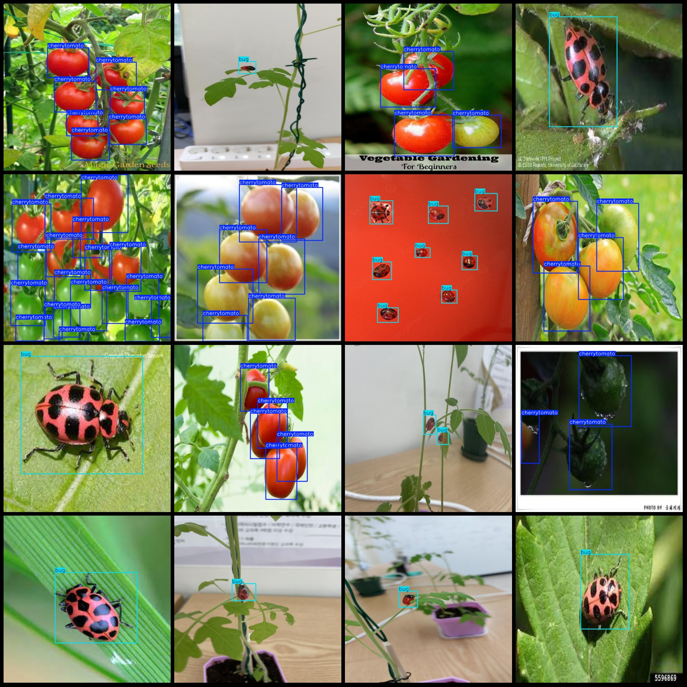
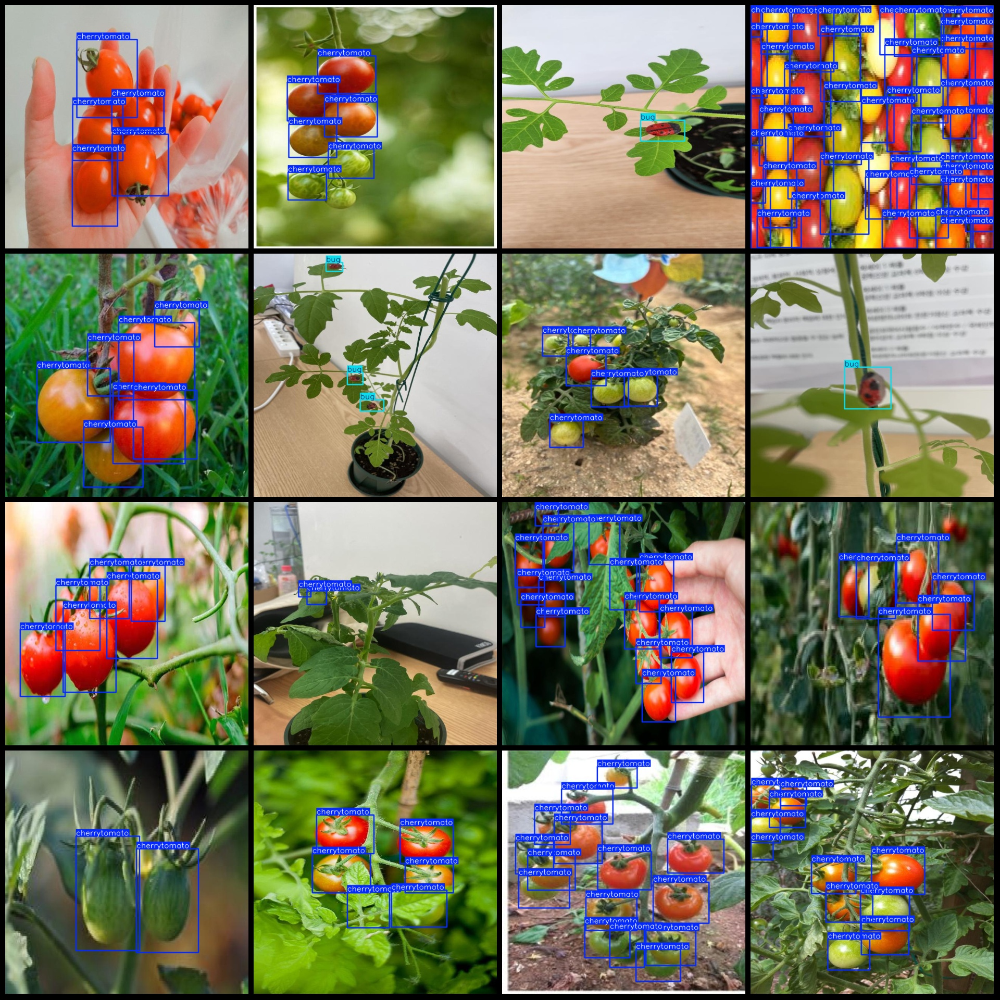

# Sweet Pepper and Pest Detection Dataset VOC+YOLO format with 476 images in two categories

Dataset format: Pascal VOC format + YOLO format (txt file without split path, only containing jpg images and corresponding VOC format xml files and yolo format txt files)
number of images: 476  
annotation count: 476  
annotation count: 476  
Label count: 2
Annotation class names in the Yolo format are not necessarily consistent with this order, but rather, they should be based on the labelsfile directory's classes.txt file.
boxes per class:   
Bug Count = 234
2552
Total Frames: 2786
Number of images per category:
bug images = 158  
Cherry tomato has 318 pictures.
Image resolution: 640x640
Use the annotation tool: labelImg
Annotation rules: draw a rectangle around the class.
Important notes: The dataset does not have separate training, validation, and test sets, so they need to be manually divided.
Special statement: This dataset does not guarantee the accuracy of the trained model or weight file.
Image preview:
Example:
## Images

Here is a pay link on Stripe ( https://buy.stripe.com/3cs8yP7sY87d0vu9AB ). Please contact me lonlonago@foxmail.com after funding $89, and I will send you a complete data files , thank you!

